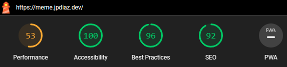

# Memes API Generator 🤣

This is a simple project that consumes the [Meme_Api](httpsgithub.comD3vdMeme_Api) and displays the results in a simple and clean way.

<!-- BUILD WITH -->

### Built With 🔑

This project was developed using

<!-- CONTENT -->

## Content 🚦

This project was born as part of my effort to learn how to consume an API. I used the [Meme_Api](httpsgithub.comD3vdMeme_Api).

[Demo](https://meme.jpdiaz.dev/)

### Lighthouse Score 🚀

<!-- LICENSE -->

## License 📜

Distributed under the MIT License.

<!-- RELATED PROJECTS -->

## Projects 🚀

## Courses & Certifications

For more information regarding my completed courses and certificates, please click on:

<!-- ACKNOWLEDGMENTS -->

## Acknowledgments 📚

Resources list that I find helpful and would like to give credit to.

- [React](https://reactjs.org/)
- [Vite](https://vitejs.dev/)
- [Tailwind CSS](https://tailwindcss.com/)
